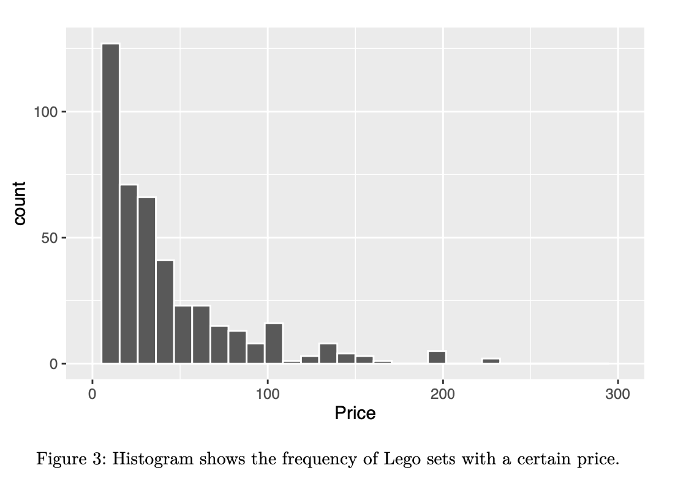

> Investigate the relationship between the prices of LEGO® sets
and the number of pieces in the set and its theme to gain a better understanding of where consumer's money
is going and identify which specific franchises within LEGO® have the best price-to-piece ratio.

## Table of Contents

1. [Introduction](#introduction)
    
2. [Exploratory data analysis](#data-analysis)
 
3. [Modeling Analysis](#modeling)

4. [Conclusion](#conclusion)

## 1. Introduction
[Back to ToC](#toc)

Since their introduction to the US market in the 1960s, LEGOs have been a popular gift and creative outlet for many 
children. LEGO takes a different approach to toys, as they offer children the opportunity to think creatively and 
assemble their gift rather than being given a toy that is ready-made. The process of building LEGOs can be a challenging 
activity that keeps children engaged for long periods of time. In addition to being unique within the toy market, LEGO 
offers thousands of sets with a variety of themes in an attempt to reach a more diverse audience.

These sets can range in price anywhere from tens of dollars to hundreds, so as a consumer, it’s important to know that
you’re getting a good deal while also receiving a good product. According to a statement from LEGO, they determine their 
prices based on a variety of factors such as the number of new and unique molds required to create the pieces in the set 
in addition to the cost of licensing characters from other companies and brands. Knowing this and knowing that LEGO has 
many different franchises for many different target demographics, how can we make sure that consumers are getting the most 
out of their money?

Our project investigates how prices of LEGO sets relate to the number of pieces in the set and its theme. We were interested
in investigating this question to gain a better understanding of where consumers’ money is going, and which specific franchises 
within Lego are best for price/piece ratio. Our process for addressing this question began with downloading the data, which we 
obtained from a scraped data set (from Brickset and BrickInstructions.com) that had previously been merged using R. The dataset 
includes many variables describing individual LEGO building brick sets that were produced between January 1, 2018 and September 11, 2020.

Some of the variables included in the data are the set name, the year it was published, its theme, the age range it’s meant for, 
the pieces count, and more. We limited these variables by focusing directly on the theme of the set, total number of pieces in the set, 
and the price of the set. There were 41 different themes included in the dataset, so we decided to limit our research to the five themes 
that had the most sets within the data. We first decided to conduct a hypothesis test on the relationship between the amount of pieces 
and price of the LEGO sets regardless of theme as quantified by their regression coefficients. Then, we decided to focus more specifically 
on the LEGO Star Wars and LEGO City sets by running a hypothesis test on their difference in mean prices.

An important distinction to make here is that we used the Price variable versus the Amazon_Price variable, which could have given us different results.

## 2. Exploratory data analysis
[Back to ToC](#toc)

To narrow down this large data set, we decided to select a few set themes to analyze. We chose LEGO Star Wars, LEGO Friends, LEGO City, 
LEGO NINJAGO, and LEGO Duplo, as these were the five themes that had the highest number of LEGO sets in the data according to Table 1. 
After filtering for these selected themes, we ended up analyzing 454 LEGO sets out of the 1304 that were in the original data set.

To find the connection between price and theme, we created a table that divides up the sets by theme and found each themes’ mean, median, standard deviation, and total number of sets.

According to Table 2, Star Wars has the most expensive mean and median price (𝑥̄ = 60.63, median = 29.99), while Friends has the cheapest 
mean and median price (𝑥̄ = 30.06, median = 19.99), following DUPLO closely in mean price (𝑥̄ = 30.59). City (and Star Wars) have the most 
expensive median price (median = 29.99) and DUPLO and NINJAGO (and Friends) have the cheapest median price (median = 19.99).

After selecting our five different themes to analyze, we created boxplots to show the distribu- tions of the price among these five different 
LEGO themes. Among the LEGO Star Wars sets, the set “Imperial Star Destroyer” with a cost of $699.99 and the set “Betrayal at Cloud City” with 
a cost of $349.99 were outliers among the rest of the themes, so we limited our Price variable on the Y axis to $300. From this, we could see 
that LEGO City and LEGO Star Wars sets have a higher median price than the other themes. LEGO City and LEGO Star Wars also have higher variance 
in terms of price with larger box shapes and longer boxplot whiskers.

Next, we wanted to measure the frequency of LEGO sets with a certain number of pieces. We did this by creating a histogram with the Pieces variable 
on the X axis. This histogram has a positive skew and we can see that most of the LEGO sets in our data have less than 250 pieces. The histogram 
has high variability since the distribution flattens out as the number of pieces increases, displaying large peaks in sets with less than 250 pieces 
but then petering out after that.

We then looked at the price variable and the number of LEGO sets that fall under each price point. We decided to limit our price variable to $300 
again to keep our distributions consistent, so we had two outlier sets, which were the “Imperial Star Destroyer” which cost $699 and the set 
“Betrayal at Cloud City” with a cost of $349.99. Similar to our previous Pieces/Count distribution, there is a positive skew to the distribution.

Next, we created a scatter plot to look at the relationship between the number of pieces (X axis) and the price (Y axis) while sorting by theme. 
Each dot color represents a new theme and we used the geom_smooth function to give each Theme its own slope. To keep things consistent with the last few 
visualizations, we limited our pieces function to 4000 pieces and limited our price function to $300. 

From here, we can see that there is a positive relationship between Pieces and Price regardless of the LEGO set theme. While DUPLO sets have the steepest 
slope, they also have the smallest range in price and number of pieces. Star Wars, on the other hand, has the widest range of both price and number of 
pieces in their LEGO sets.

## 3. Modeling Analysis
[Back to ToC](#modeling) 

First, we wanted to test if there was in fact a relationship between the number of pieces and the price, as explored with the scatter plot. To do this, 
we created a linear regression table in order to perform a hypothesis test based on the regression coefficient. In this hypothesis test, our null hypothesis 
is that the slope would be equal to zero, meaning that there is no evidence to conclude that there is a relationship between the two variables:

𝐻0 ∶ 𛽠= 0

Meanwhile, our two-sided alternative hypothesis states that the slope is not zero, which would indicate some sort of relationship between the number of pieces and price:

ğ»ğ´ ∶ 𛽠≠ 0

Using permutations, we created a null distribution of the slope, which represents the relation- ship between the number of pieces and price.
The figure below displays the null distribution with the p-value, or the region of values that are as extreme or more extreme than the observed slope (0.11) (Figure 5).

We set the significance level, or alpha level, to 0.05, representing the 5% most extreme values. Since the p-value of 0 is less than the alpha level of 0.05, we can reject 
the null hypothesis and can conclude that there is a relationship between the number of pieces and price of a LEGO set.

The linearity assumption does not appear to be violated since there is not a clear relationship between the predicted Price values from the regression model and the residuals. 
There does appear to be a weak equal variance violation because the vertical spread of the residuals changes slightly as you move left to right on the plot.

There is no violation of normality since the distribution of the residuals appears to be bell- shaped and thus follows a Normal distribution. In addition, there is no evidence 
of a violation of the independence assumption since the data was collected in such a way that there is no link between one LEGO set and another. No LEGO set was measured twice for any reason. 
Thus, there is no evidence to show that there is a dependence between residual errors.

Since the L.I.N.E assumptions have not been significantly violated, we are confident that we can use the regression model to draw inferences about the regression coefficients.

We decided to also run a hypothesis test on the mean cost of LEGO Star Wars sets versus the mean cost of LEGO City sets, since we found in the exploratory data analysis that these 
sets had the most variance in price. Our null hypothesis was that there is no difference in the average price of LEGO Star Wars sets and the average price of LEGO City sets, while our
alternative hypothesis was that there is a difference in the average price of LEGO Star Wars sets and the average price of LEGO City sets. To find our test statistic, we created a chart 
of the average price of each LEGO theme. As illustrated in Table 4, LEGO Star Wars sets have an average cost of $60.60 while LEGO City sets have an average cost of $44.90. The difference 
in means between the two is $15.70.

The null hypothesis is as follows: the difference between the average price of Star Wars themed lego sets and the average price of City themes lego sets is 0.

𝐻0 ∶ğœ‡ğ‘†ğ‘¡ğ‘ğ‘Ÿğ‘Šğ‘ğ‘Ÿğ‘  −ğœ‡ğ¶ğ‘–ğ‘¡ğ‘¦ =0

The alternative hypothesis is as follows: the difference between the average price of Star Wars themed lego sets and the average price of City themes lego sets is not 0.

ğ»ğ´ ∶ğœ‡ğ‘†ğ‘¡ğ‘ğ‘Ÿğ‘Šğ‘ğ‘Ÿğ‘  −ğœ‡ğ‘ğ¼ğ‘ğ½ğ´ğºğ‘‚ ≠0

Next, we used permutation to create a null distribution of the difference in mean costs of these two themes. The null distribution is displayed in Figure 4.

On the null distribution, we shaded the p-value, which represents values as extreme or more extreme than the observed difference in means ($15.7) between Star Wars and City themes.

 

 
We set the alpha value to 0.05 and shaded it on a separate distribution. Alpha is the risk of running a Type I error which means there is a 5% chance that we conclude there is a
difference in mean costs between Star Wars and City sets when there actually is not. It is also the significance level, meaning it’s 5% of the most extreme values. Since our p-value 
is 0.126 and larger than our alpha value of 0.05, we must fail to reject our null hypothesis, meaning that we found no evidence that these two particular LEGO themes mean prices are different.

      
## 4. Conclusion
[Back to ToC](#toc)

Throughout the report, we performed multiple tests to answer our research question of “what is the relationship between the price of LEGO sets versus number of pieces and theme?”. 
For our analysis, we limited our research to the five themes with the highest number of LEGO sets (Star Wars, City, Duplo, Friends, NINJAGO) to save time, but if we had more resources, 
we could have conducted null hypothesis tests and analyzed the regression table for every theme to get the most accurate results.

First, regression table 3 answers whether there is a relationship between pieces and price. From here, we were able to compare our p-value of 0 with our set alpha value of 0.05 and concluded 
that there is a relationship between pieces and price of a LEGO set. This makes sense because the more pieces a LEGO set has, the more expensive LEGO will sell it for. While we chose to analyze 
the Price variable, the Amazon_Price variable often had a slightly lower price. A possible future variation of this experiment could be to use these Amazon prices instead and to compare the results.

Next, the hypothesis test comparing the differences in means between Star Wars and City sets answers whether there is a relationship between price and theme. According to our results, we found no 
evidence that the mean prices of Star Wars and City themed sets are different. I would expect that Star Wars theme is more expensive than City because Star Wars is more popular, but the findings say 
otherwise. Regardless of how popular a theme is, they are still the same price as other themes. While this may be true for these themes, we did not run this experiment comparing the average prices of 
the other themes we looked at. If we had compared LEGO NINJAGO and LEGO Friends sets’ average prices for example, we may have gotten completely different results entirely.   